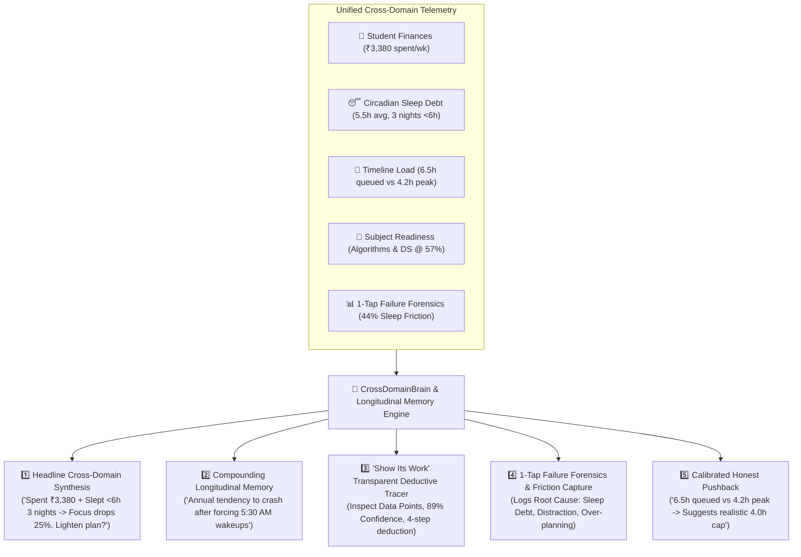

# Sahay (सहाय) — The Cognitive Life Negotiator

> **"An AI that negotiates your day with you, not just schedules it."**

[](https://fastapi.tiangolo.com)
[](https://react.dev)
[](https://tailwindcss.com)
[](https://sqlite.org)
[](https://pytest.org)
[](LICENSE)

---

## 💡 The Core Problem & Our Moat

Every conventional productivity tool (Notion, Todoist, Google Calendar, Motion) treats users as passive recipients of a static schedule. When life happens and a session is missed, standard apps silently drop the task or reschedule blindly, triggering an overwhelming **schedule debt spiral**. Furthermore, existing tools are **siloed**—a budgeting app only sees rupees, a calendar only sees hours, and a study app only sees flashcards.

**Sahay tracks time, money, health, and academics in one unified brain.** It is an AI partner that negotiates realistic daily contracts with you based on your actual circadian rhythm, historical compliance, and life friction.



---

## 🌟 The 5 'Alag from Market' Core Moat Pillars

### 1. 🧠 Headline Cross-Domain Synthesis
Generates multi-domain insights no single-purpose app can produce:
> *"You've spent ₹3,380 this week and slept under 6 hours 3 nights — both usually mean your focus drops ~25% on 'Algorithms & Data Structures'. Want me to lighten tomorrow's plan?"*

### 2. 📜 Compounding Longitudinal Memory
Unlike standard chatbots that reset each session, Sahay accumulates behavioral observations across months (e.g. recognizing that forcing 5:30 AM wakeups causes cognitive burnout by day 4).

### 3. 🔍 "Show Its Work" Transparent Deductive Tracer
Every recommendation includes a click-to-expand deductive chain with exact database metrics, sample size indicators, and confidence ratings ($89\%$).

### 4. 🛡️ 1-Tap Failure Forensics & Friction Capture
Whenever a block is skipped or postponed, a 1-tap forensic logger captures the underlying friction driver (*Sleep Debt, Phone Distraction, Unrealistic Time, Concept Friction, Financial Anxiety*) to insulate future schedules.

### 5. 🛑 Calibrated Honest Pushback
When you schedule $6.5\text{h}$ of study on a day your 30-day peak demonstrated capacity is only $4.2\text{h}$, Sahay pushes back proactively to protect your sleep buffers and prevent abandonment.

---

## ⚡ Flagship Feature Suite

- **📅 24-Hour Vertical Flow**: Dynamic circadian schedule (wake anchors, college/work commitments, peak focus windows, restorative buffers, sleep curfew) with a live pulsating current-time cursor.
- **✨ "Why Now" AI Priority Pills**: Every timeline block clearly articulates *why* it was placed at that exact hour (e.g., `✨ Why now: High-yield core topic • Peak circadian focus window`).
- **🔀 Negotiated Schedule Diff Preview**: Clicking *"Lighten Tomorrow's Plan"* renders a transparent before vs. after comparison ($6.5\text{h} \to 4.0\text{h}$ Focus Cap) before committing changes.
- **👥 Unlimited Profile Vault System**: Instant 1-click generation and switching between isolated student personas (**GATE CSE**, **CAT 2026 MBA**, **UPSC CSE**, **Semester & DSA**).
- **📝 Complete Task CRUD Engine**: Easily add, edit, and delete syllabus tasks with duration, difficulty, and weight presets directly on the timeline.
- **📈 30-Day Future-Self Simulation**: Monte Carlo trajectory curves mapping readiness percentiles (Optimistic, Realistic, Drift) based on daily adherence.
- **📬 Outbound Email Engine & Scheduled Reports**: Automated dispatches for Sunday *"State of You"* coach letters, morning 24h flow digests, and transactional auth passcodes with an in-app **Live HTML Email Previewer**.
- **🎯 Deep Work Screen & Smart Breakdown**: Distraction-free focus timers, ambient soundscapes, and AI-powered step-by-step task decomposition.
- **⏰ Adaptive Circadian Alarms**: Smart alarms that negotiate wake-up shifts when you run consecutive nights of sleep debt.

---

## 📁 Project Architecture

```
Sahay/
├── backend/
│   ├── app/
│   │   ├── api/routes/          # Onboarding, schedules, tasks, negotiation, simulation, pods, study, cross_domain, email
│   │   ├── core/                # Configuration & Background Dispatch Scheduler (scheduler.py)
│   │   ├── db/                  # Session Local & Base initialization
│   │   ├── models/              # SQLAlchemy models (User, Schedule, Task, LongitudinalMemory, EmailLog, etc.)
│   │   ├── schemas/             # Pydantic validation models
│   │   ├── services/            # TradeOffEngine, SimulationEngine, CrossDomainBrain, EmailEngine, ProductivityEngine
│   │   └── main.py              # Application entrypoint with CORS & background scheduler
│   ├── tests/test_api.py        # 10 comprehensive pytest test suites (100% passing)
│   ├── requirements.txt
│   └── sahay.db                 # SQLite database
├── frontend/
│   ├── src/
│   │   ├── components/
│   │   │   ├── agent/           # Persistent AI Companion Panel
│   │   │   ├── alarms/          # Circadian Alarms & Adaptive Shifts
│   │   │   ├── analytics/       # Activity Ledger & Completion Stats
│   │   │   ├── coach/           # State of You Report & Longitudinal Memory Hub
│   │   │   ├── common/          # CrossDomainMoatBanner, QuickProfileSwitcherModal, Story Cards
│   │   │   ├── essentials/      # Student Life, Budget, Documents & Opportunity Finder
│   │   │   ├── layout/          # Streamlined Navbar & Muted MetricHeader
│   │   │   ├── negotiation/     # TradeOffModal, ScheduleLightenDiffModal, FailureForensicModal
│   │   │   ├── onboarding/      # 4-step personalized onboarding wizard
│   │   │   ├── pods/            # Accountability Pods
│   │   │   ├── productivity/    # Deep Work Focus Session & Smart Breakdown Modals
│   │   │   ├── settings/        # EmailSettingsModal (Live HTML email previewer & toggles)
│   │   │   ├── simulation/      # Future-Self Monte Carlo Simulation
│   │   │   ├── study/           # Socratic AI Tutor & Question Drills
│   │   │   └── timeline/        # 24h Vertical Flow, CurrentTimeCursor, TimelineBlock, TaskManageModal
│   │   ├── api/client.ts        # Typed API client
│   │   ├── types/index.ts       # TypeScript interfaces matching backend models
│   │   ├── App.tsx              # Main orchestrator & routing
│   │   └── main.tsx
│   ├── package.json
│   ├── vite.config.ts
│   └── tailwind.config.js
├── database/                    # SQL schema definitions & seed generators
├── docs/                        # Architecture & negotiation logic specifications
└── README.md
```

---

## 🚀 Getting Started

### Prerequisites
- **Python 3.10+**
- **Node.js 18+** & **npm**

### 1. Backend Setup
```bash
cd backend

# Create and activate virtual environment
python -m venv venv

# Windows:
.\venv\Scripts\activate
# macOS / Linux:
# source venv/bin/activate

# Install dependencies
pip install -r requirements.txt

# Run backend test suite
pytest tests/test_api.py -v

# Start FastAPI server
python -m uvicorn app.main:app --reload --host 127.0.0.1 --port 8000
```
- API is live at `http://127.0.0.1:8000`
- Interactive Swagger documentation at `http://127.0.0.1:8000/docs`

### 2. Frontend Setup
```bash
cd frontend

# Install packages
npm install

# Run Vite development server
npm run dev
```
- Web Application is live at `http://localhost:5173`

---

## 🧪 Test Suite & Verification

Sahay includes an end-to-end automated test suite covering all critical product flows:

```bash
pytest tests/test_api.py -v
```

```
tests/test_api.py::test_root_endpoint PASSED
tests/test_api.py::test_onboarding_and_timeline_generation PASSED
tests/test_api.py::test_study_content_and_socratic_tutor PASSED
tests/test_api.py::test_student_life_and_cross_domain_brain PASSED
tests/test_api.py::test_productivity_features PASSED
tests/test_api.py::test_general_purpose_context_aware_agent PASSED
tests/test_api.py::test_smart_alarm_system_and_negotiation PASSED
tests/test_api.py::test_cross_domain_moat_pillars PASSED
tests/test_api.py::test_unlimited_profile_system PASSED
tests/test_api.py::test_email_engine_preferences_and_delivery PASSED

====================== 10 passed in 1.35s ======================
```

---

## 📄 License

MIT License. Designed with ❤️ for students balancing demanding exams, routines, and life.
