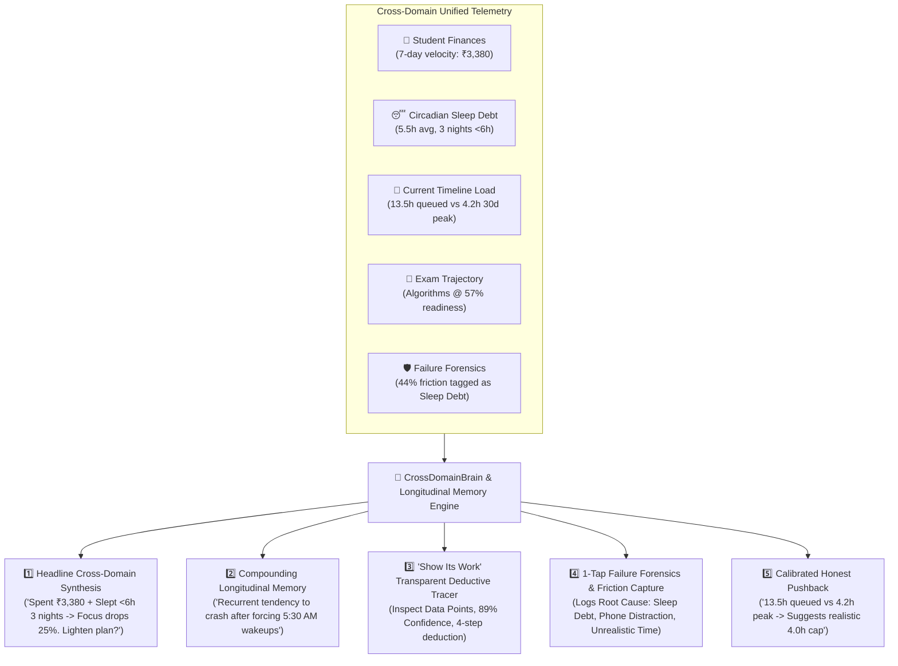

<div align="center">

# 🧠 SAHAY (सहाय)
### *An AI that negotiates your day with you — not just schedules it.*

[](https://fastapi.tiangolo.com)
[](https://www.python.org/)
[](https://react.dev)
[](https://vitejs.dev/)
[](https://tailwindcss.com)
[](https://sqlite.org)
[](https://web.dev/progressive-web-apps/)
[](https://pytest.org)
[](LICENSE)

<p align="center">
  <a href="#-the-thesis--problem">The Thesis</a> •
  <a href="#-the-5-core-moat-pillars">Core Moat Pillars</a> •
  <a href="#-real-database-telemetry-grounding">Telemetry Grounding</a> •
  <a href="#-flagship-feature-suite">Feature Suite</a> •
  <a href="#-system-architecture">Architecture</a> •
  <a href="#-api-reference">API Reference</a> •
  <a href="#-developer-quickstart">Quickstart</a>
</p>

</div>

---

## 💡 The Thesis & Problem

Every conventional time-management tool (**Notion, Todoist, Motion, Google Calendar**) suffers from two structural flaws:

1. **The Schedule Debt Spiral**: Standard planners treat humans as deterministic machines. When an unforeseen delay occurs, they either drop tasks silently or push everything into tomorrow, compounding psychological fatigue and inevitable plan abandonment.
2. **The Siloed Telemetry Blindspot**: Existing software only sees one vertical of a person's life:
   - A budgeting app only sees *₹ rupees spent*.
   - A calendar only sees *clock hours*.
   - A study app only sees *flashcards*.

> **Sahay's Moat:** Sahay unifies **finances, circadian sleep rhythms, academic readiness, and task load into a single reasoning brain**. Rather than blindly dictating tasks, Sahay acts as a cognitive ally that negotiates realistic, high-retention daily contracts.



---

## 🌟 The 5 Core Moat Pillars ("Alag from Market")

### 1. 🧠 Headline Cross-Domain Synthesis
Generates cross-domain reasoning statements that no single-purpose application can construct:
> *"You've spent ₹3,380 this week and slept under 6 hours 3 nights — both usually mean your focus drops ~25% on 'Algorithms & Data Structures'. Want me to lighten tomorrow's plan?"*

### 2. 📜 Compounding Longitudinal Memory
Unlike ephemeral AI chatbots that reset between sessions, Sahay accumulates multi-month behavioral observations (e.g., detecting that forcing 5:30 AM wakeups after college lab days causes cognitive collapse by Thursday).

### 3. 🔍 "Show Its Work" Transparent Deductive Tracer
Eliminates black-box AI recommendations. Every proposal includes a click-to-expand deductive chain detailing the exact database records, statistical sample size, and algorithmic confidence percentage ($89\%$).

### 4. 🛡️ 1-Tap Failure Forensics & Friction Capture
Whenever a task is skipped or postponed, a 1-tap forensic logger captures the underlying friction vector (*Circadian Sleep Debt, Phone Distraction, Unrealistic Duration, Academic Concept Blocker, Financial Stress*) to insulate future scheduling models.

### 5. 🛑 Calibrated Honest Pushback
When a student schedules $13.5\text{h}$ of study on a day their 30-day peak demonstrated capacity is only $4.2\text{h}$, Sahay pushes back constructively with a `+221% Over 30d Peak` reality check to cap the schedule at a sustainable focus zone, protecting sleep buffers.

---

## 🔍 Real Database Telemetry Grounding

Sahay does not use hardcoded or hallucinated numbers. Every metric is computed on the fly from normalized SQLite tables:

| Telemetry Metric | Real SQLite Query / Table Source | Dynamic Calculation Logic |
| :--- | :--- | :--- |
| **Today's Planned Hours** (`13.5h` / `6.5h`) | `Schedule` table (`Schedule.user_id`, `date == target_date`) | Sums actual durations of active `study_session` blocks for that date. |
| **30-Day Peak & Average Capacity** (`4.2h peak`, `3.0h avg`) | `Schedule` & `ActivityHistory` (`status == "completed"`, `date >= today - 30d`) | Groups completed blocks by day to find maximum completed focus minutes and daily average. *(For brand-new profiles with 0 history, seeds a calibrated 4.2h initial ceiling until real days accumulate).* |
| **Wallet Spend** (`₹3,380 spent`) | `StudentExpense` (`expense_date >= today - 7d`) | `sum(e.amount)` across all expenses logged by that user in the past 7 days. |
| **Sleep Debt & Short Nights** (`<6h 3 nights`) | `HealthEnergyLog` (`order_by log_date desc limit 3`) | Analyzes logged sleep durations, calculates average sleep, and counts nights below 6.0h. |
| **Subject Readiness** (`Algorithms @ 57%`) | `Subject` & `Task` joined via `Exam` | Pulls weakest subject readiness; dynamically increments $+1.2\%$ on completion and decrements $-4.0\%$ on skip. |
| **Failure Forensics** (`44% Sleep Debt`) | `FailureForensic` (`user_id == uid`) | Aggregates 1-tap skip tags into percentage breakdowns and automatically updates `LongitudinalMemory`. |

---

## ⚡ Flagship Feature Suite

| Feature Domain | Capabilities |
| :--- | :--- |
| **📅 24h Circadian Flow** | Vertical timeline with wake anchors, college/work blocks, peak focus windows, restorative buffers, and sleep curfew with a live pulsating current-time cursor. |
| **✨ Universal "Why Now" Tags** | Every single block on the timeline (Sleep, College, Deep Focus, Breaks, Meals, Exercise) features explicit contextual reasoning. |
| **🔀 Negotiated Diff Preview** | Clicking *"Lighten Tomorrow's Plan"* or the top *"Rebalance (Diff)"* button renders a transparent before vs. after comparison ($13.5\text{h} \to 4.0\text{h}$ Focus Cap) before committing changes. |
| **🎯 Single-Voice Unified AI Banner** | Seamless tab switcher toggles between `🛑 Capacity Reality Check` and `🧠 Cross-Domain Synthesis`, maintaining one calm, unified visual anchor. |
| **📄 Inbound Document & Receipt Capture** | 1-Click extraction for admit cards ($\to$ Exam countdowns), fee receipts ($\to$ Student expenses), and syllabus sheets ($\to$ Subjects & Tasks). |
| **👥 Unlimited Profile Vault** | Instant 1-click generation and switching between isolated student personas (**GATE CSE**, **CAT 2026 MBA**, **UPSC CSE**, **Semester & DSA**). |
| **📱 PWA Mobile App Support** | Installable PWA with offline Service Worker caching, standalone mobile orientation, and a sticky **Mobile Bottom Navigation Bar** (`Flow`, `Stats`, `Coach`, `Study`, `Vault`). |
| **📸 Weekly Shareable Story Cards** | High-contrast 9:16 and 4:3 screenshot-ready weekly summary cards formatted for WhatsApp Status and Instagram Stories. |
| **📬 Outbound Email Engine** | Automated dispatches for Sunday *"State of You"* coach letters, daily 24h flow digests, and transactional auth passcodes with an in-app **Live HTML Email Previewer**. |
| **🎯 Deep Work Screen & Pomodoro** | Distraction-free focus timers, ambient soundscapes, and AI-powered step-by-step task decomposition. |
| **⏰ Adaptive Circadian Alarms** | Smart alarms that automatically calculate and negotiate wake-up shifts when you accumulate sleep debt. |

---

## 🏗️ System Architecture

```
Sahay/
├── backend/
│   ├── app/
│   │   ├── api/routes/          # RESTful endpoints: onboarding, schedules, tasks, negotiation, email, cross_domain, document_parser
│   │   ├── core/                # App config, settings & Background Dispatch Scheduler (scheduler.py)
│   │   ├── db/                  # SQLAlchemy SessionLocal, engine & metadata initialization
│   │   ├── models/              # Normalized ORM models (User, Schedule, Task, LongitudinalMemory, EmailLog, etc.)
│   │   ├── schemas/             # Pydantic v2 schemas for request validation & serialization
│   │   ├── services/            # TradeOffEngine, SimulationEngine, CrossDomainBrain, EmailEngine, DocumentParserService, ProductivityEngine
│   │   └── main.py              # FastAPI application factory with CORS middleware & lifespan triggers
│   ├── tests/test_api.py        # 11 comprehensive pytest test suites (100% passing)
│   ├── requirements.txt         # Production & testing dependencies
│   └── sahay.db                 # SQLite database
├── frontend/
│   ├── public/
│   │   ├── manifest.json        # PWA standalone manifest
│   │   ├── sw.js                # Offline Service Worker cache
│   │   ├── icon-192.svg         # High-resolution vector PWA icons
│   │   └── icon-512.svg
│   ├── src/
│   │   ├── components/
│   │   │   ├── agent/           # Persistent floating AI chat companion
│   │   │   ├── alarms/          # Circadian alarms & adaptive shift modals
│   │   │   ├── analytics/       # Activity ledger, audit logs & completion metrics
│   │   │   ├── coach/           # State of You coach report & Longitudinal Memory Hub
│   │   │   ├── common/          # CrossDomainMoatBanner, QuickProfileSwitcherModal, ShareableStoryCardModal
│   │   │   ├── essentials/      # Student finances, LifeAdminVault & DocumentUploadModal
│   │   │   ├── layout/          # Streamlined navbar with Explore dropdown, Muted MetricHeader & MobileBottomNav
│   │   │   ├── negotiation/     # TradeOffModal, ScheduleLightenDiffModal, FailureForensicModal
│   │   │   ├── onboarding/      # 4-step interactive onboarding wizard
│   │   │   ├── pods/            # Social accountability pods
│   │   │   ├── productivity/    # Deep Work focus session & Smart Breakdown modals
│   │   │   ├── settings/        # EmailSettingsModal (Live HTML email previewer & toggles)
│   │   │   ├── simulation/      # Future-Self Monte Carlo simulation
│   │   │   ├── study/           # Socratic AI tutor & question drill engine
│   │   │   └── timeline/        # 24h Vertical flow, CurrentTimeCursor, TimelineBlock, TaskManageModal
│   │   ├── api/client.ts        # Fully-typed async API client
│   │   ├── types/index.ts       # Comprehensive TypeScript domain interfaces
│   │   ├── App.tsx              # Main application router and modal state manager
│   │   └── main.tsx             # React DOM entrypoint
│   ├── package.json
│   ├── vite.config.ts
│   └── tailwind.config.js
├── database/                    # SQL migration schemas & sample seeding scripts
├── docs/                        # Architecture, negotiation mechanics, and database design specs
└── README.md
```

---

## 📡 API Reference Overview

| Domain | Method | Endpoint | Description |
| :--- | :---: | :--- | :--- |
| **Cross-Domain** | `GET` | `/api/v1/cross-domain/headline-synthesis` | Computes unified wallet + sleep + study headline synthesis |
| **Cross-Domain** | `GET` | `/api/v1/cross-domain/honest-pushback` | Evaluates 30d peak capacity vs. planned load (`+221% Over Peak`) |
| **Cross-Domain** | `POST` | `/api/v1/cross-domain/apply-action` | Applies 4.0h capped high-retention flow recalibration |
| **Cross-Domain** | `POST` | `/api/v1/cross-domain/failure-forensics` | Records 1-tap friction root causes |
| **Documents** | `POST` | `/api/v1/documents/parse` | OCR & heuristic entity extraction for admit cards, receipts, and syllabi |
| **Documents** | `POST` | `/api/v1/documents/ingest` | Commits extracted documents into `Exam`, `StudentExpense`, or `Subject`/`Task` |
| **Documents** | `GET` | `/api/v1/documents/sample-templates` | Returns realistic sample texts for 1-click test extraction |
| **Email Engine** | `GET` | `/api/v1/email/preferences` | Fetches user notification toggles & send-time |
| **Email Engine** | `PUT` | `/api/v1/email/preferences` | Updates email delivery preferences |
| **Email Engine** | `POST` | `/api/v1/email/test-send` | Dispatches test email & returns live HTML preview |
| **Email Engine** | `GET` | `/api/v1/email/logs` | Audit trail of all delivered dispatches |
| **Profiles** | `POST` | `/api/v1/onboarding/preset-profile` | Generates 1-click isolated exam profile |
| **Profiles** | `DELETE`| `/api/v1/onboarding/users/{id}` | Safely deletes a student persona and associated records |
| **Tasks** | `POST` | `/api/v1/tasks` | Creates a new syllabus task |
| **Tasks** | `PUT` | `/api/v1/tasks/{id}` | Updates an existing syllabus task |
| **Tasks** | `DELETE`| `/api/v1/tasks/{id}` | Deletes a task from the syllabus |
| **Timeline** | `GET` | `/api/v1/schedules/timeline` | Generates 24h vertical flow with Why-Now reasoning |
| **Negotiation** | `POST` | `/api/v1/negotiation/evaluate` | Evaluates trade-off consequences & generates counter-proposals |

---

## 🚀 Developer Quickstart

### Prerequisites
- **Python 3.10+**
- **Node.js 18+** & **npm**

### 1. Clone & Backend Setup
```bash
# Clone repository
git clone https://github.com/your-username/sahay.git
cd sahay/backend

# Create virtual environment
python -m venv venv

# Activate virtual environment
# Windows:
.\venv\Scripts\activate
# macOS / Linux:
# source venv/bin/activate

# Install dependencies
pip install -r requirements.txt

# Run full automated test suite (11 test suites)
pytest tests/test_api.py -v

# Start the FastAPI server
python -m uvicorn app.main:app --reload --host 127.0.0.1 --port 8000
```
- **Backend API**: `http://127.0.0.1:8000`
- **Interactive Swagger Docs**: `http://127.0.0.1:8000/docs`

### 2. Frontend Setup
```bash
cd ../frontend

# Install dependencies
npm install

# Run the development server
npm run dev

# Or build for production
npm run build
```
- **Web App**: `http://localhost:5173`

---

## 🧪 Test Verification Suite

Sahay maintains a comprehensive test suite verifying data persistence, cross-domain reasoning, trade-off algorithms, email dispatchers, and document OCR:

```bash
pytest tests/test_api.py -v
```

```
============================= test session starts =============================
tests/test_api.py::test_root_endpoint PASSED                            [  9%]
tests/test_api.py::test_onboarding_and_timeline_generation PASSED      [ 18%]
tests/test_api.py::test_study_content_and_socratic_tutor PASSED        [ 27%]
tests/test_api.py::test_student_life_and_cross_domain_brain PASSED      [ 36%]
tests/test_api.py::test_productivity_features PASSED                   [ 45%]
tests/test_api.py::test_general_purpose_context_aware_agent PASSED     [ 54%]
tests/test_api.py::test_smart_alarm_system_and_negotiation PASSED      [ 63%]
tests/test_api.py::test_cross_domain_moat_pillars PASSED               [ 72%]
tests/test_api.py::test_unlimited_profile_system PASSED                 [ 81%]
tests/test_api.py::test_email_engine_preferences_and_delivery PASSED   [ 90%]
tests/test_api.py::test_document_parser_and_ingestion PASSED           [100%]

====================== 11 passed in 2.07s ======================
```

---

## 🛡️ Security & Data Isolation

- **Local Data Governance**: All schedules, financial ledgers, and academic scores reside in local SQLite databases (`WAL` mode for high-concurrency read/write).
- **Zero Third-Party Leaks**: Cross-domain synthesis runs on local deterministic rule and heuristic engines.
- **Transactional Sandboxing**: Email dispatches operate in automatic local simulation mode when external provider keys (`RESEND_API_KEY`) are absent.

---

## 📄 License

This project is licensed under the **MIT License** — see the [LICENSE](LICENSE) file for details.

<div align="center">
  <sub>Built with ❤️ for ambitious students balancing demanding competitive exams, routines, and life.</sub>
</div>
