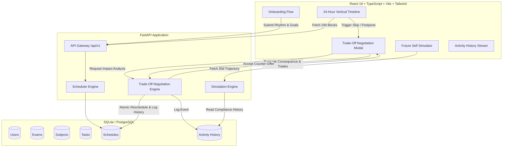

# Sahay Architecture Overview

## System Components

1. **Frontend Client**:
   - Single-page application using modern React 18, Tailwind CSS, Lucide icons, and Recharts.
   - Core interactive components: Onboarding Wizard, 24-hour vertical timeline with live hour indicator, Trade-Off Negotiator dialog, and Future Self trajectory visualizer.

2. **FastAPI Engine**:
   - High performance, asynchronous backend serving REST endpoints.
   - Dependency-injected SQLAlchemy sessions with clean Pydantic schema validation.

3. **Trade-Off Engine**:
   - Detects friction when user skips or delays.
   - Calculates numerical readiness impact and catch-up debt.
   - Emits natural human-feeling counter proposals instead of robotic schedule errors.

4. **Activity History Ledger**:
   - Immutable log of every action (done, skipped, postponed, trade accepted) providing the ground-truth data for future AI fine-tuning and predictive personalization.
