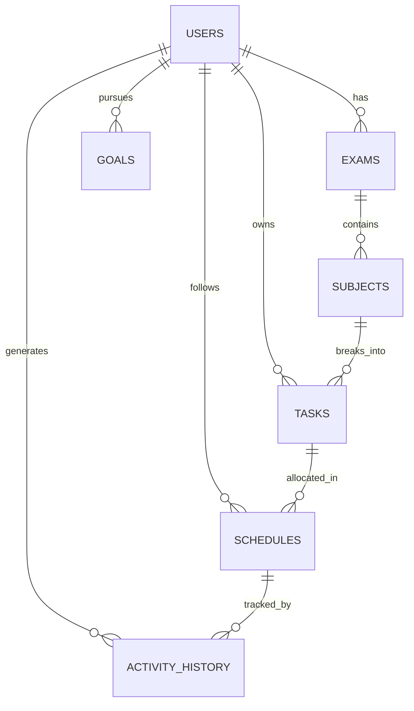

# Database Schema Design (Step 2 in Roadmap)

The Sahay data layer is designed around 7 normalized tables that power both immediate scheduling and long-term machine learning intelligence.

## Table Specifications

### 1. `users`
- `id` (PK): Integer
- `name`: String
- `email`: String (Unique)
- `wake_time`: String (HH:MM, e.g. "06:30")
- `sleep_time`: String (HH:MM, e.g. "23:30")
- `daily_capacity_hours`: Float (e.g. 6.5)
- `burnout_risk_score`: Float (0.0 to 1.0)
- `created_at`: Timestamp

### 2. `exams`
- `id` (PK): Integer
- `user_id` (FK -> users.id)
- `name`: String (e.g. "GATE CSE 2027", "UPSC 2026")
- `target_date`: Date
- `target_score`: Float (e.g. 85.0)
- `current_readiness_pct`: Float (0.0 to 100.0)

### 3. `goals`
- `id` (PK): Integer
- `user_id` (FK -> users.id)
- `title`: String
- `pillar`: String ('study', 'health', 'personal', 'career')
- `priority`: Integer (1: High, 2: Medium, 3: Low)
- `target_hours_per_week`: Float

### 4. `subjects`
- `id` (PK): Integer
- `exam_id` (FK -> exams.id)
- `name`: String (e.g. "Operating Systems")
- `total_hours_needed`: Float (e.g. 50.0)
- `hours_completed`: Float (e.g. 18.0)
- `readiness_pct`: Float (e.g. 61.0)
- `weight`: Float (e.g. 1.2)
- `color_code`: String (Hex code for UI)

### 5. `tasks`
- `id` (PK): Integer
- `user_id` (FK -> users.id)
- `subject_id` (FK -> subjects.id, nullable)
- `goal_id` (FK -> goals.id, nullable)
- `title`: String
- `description`: Text
- `estimated_duration_mins`: Integer (default 90)
- `difficulty`: String ('easy', 'medium', 'hard')
- `priority`: Integer (1, 2, 3)
- `status`: String ('todo', 'in_progress', 'completed', 'skipped', 'postponed')
- `scheduled_date`: Date

### 6. `schedules`
- `id` (PK): Integer
- `user_id` (FK -> users.id)
- `task_id` (FK -> tasks.id, nullable)
- `date`: Date
- `start_time`: String (HH:MM)
- `end_time`: String (HH:MM)
- `title`: String
- `block_type`: String ('fixed_commitment', 'study_session', 'break', 'sleep', 'buffer')
- `is_fixed`: Boolean
- `status`: String ('scheduled', 'in_progress', 'completed', 'skipped', 'postponed')
- `notes`: Text

### 7. `activity_history` (The Moat)
- `id` (PK): Integer
- `user_id` (FK -> users.id)
- `task_id` (FK -> tasks.id, nullable)
- `schedule_id` (FK -> schedules.id, nullable)
- `planned_start`: String
- `planned_end`: String
- `actual_start`: String
- `actual_end`: String
- `planned_duration_mins`: Integer
- `actual_duration_mins`: Integer
- `action`: String ('done', 'skipped', 'postponed', 'negotiated_reschedule')
- `reason`: String ('tired', 'emergency', 'procrastination', 'exam_load', 'social')
- `readiness_delta`: Float
- `burnout_impact`: Float
- `ai_negotiation_accepted`: String (Proposal ID chosen)
- `created_at`: Timestamp
